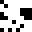

[TOC]


# 基于pHash算法的多媒体视音频管理系统

## 摘要

 		pHash算法，即感知哈希算法，是一种较为简单快速的感知散列算法，可以实现相似图片的搜索的功能。当要查找相似图片时，该算法对要比较的两个图片生成一个指纹(独特但并不唯一)，再通过指纹的对比来衡量两图片之间的相似度。一般而言，两张图片越接近，那么二者形成的指纹的差异就越小。本文通过C#对pHash和aHash算法进行了完全独立的实现，并与多媒体数据库系统相结合，实现了以图找图，进而搜到相关电影信息的功能。

## 算法来源

1. http://www.hackerfactor.com/blog/index.php?/archives/432-Looks-Like-It.html
2. https://www.phash.org/
3. Buldas, Ahto; Kroonmaa, Andres; Laanoja, Risto (2013). "Keyless Signatures' Infrastructure: How to Build Global Distributed Hash-Trees". In Riis, Nielson H.; Gollmann, D. (eds.). *Secure IT Systems. NordSec 2013*. Lecture Notes in Computer Science. **8208**. Berlin, Heidelberg: Springer. [doi](https://en.wikipedia.org/wiki/Doi_(identifier)):[10.1007/978-3-642-41488-6_21](https://doi.org/10.1007%2F978-3-642-41488-6_21). [ISBN](https://en.wikipedia.org/wiki/ISBN_(identifier)) [978-3-642-41487-9](https://en.wikipedia.org/wiki/Special:BookSources/978-3-642-41487-9). [ISSN](https://en.wikipedia.org/wiki/ISSN_(identifier)) [0302-9743](https://www.worldcat.org/issn/0302-9743). Keyless Signatures Infrastructure (KSI) is a globally distributed system for providing time-stamping and server-supported digital signature services. Global per-second hash trees are created and their root hash values published. We discuss some service quality issues that arise in practical implementation of the service and present solutions for avoiding single points of failure and guaranteeing a service with reasonable and stable delay. Guardtime AS has been operating a KSI Infrastructure for 5 years. We summarize how the KSI Infrastructure is built, and the lessons learned during the operational period of the service.
4. [^](https://en.wikipedia.org/wiki/Perceptual_hashing#cite_ref-2)Klinger, Evan; Starkweather, David. ["pHash.org: Home of pHash, the open source perceptual hash library"](http://www.phash.org/). *pHash.org*. Retrieved 2018-07-05. pHash is an open source software library released under the GPLv3 license that implements several perceptual hashing algorithms, and provides a C-like API to use those functions in your own programs. pHash itself is written in C++.

## 算法简介

​		pHash全称是感知哈希算法（Perceptual hash algorithm），该算法可以给每张图片生成一个指纹。这个指纹是独特的，但不是唯一的，例如当两张图片非常相似时，也会产生相同的指纹。通常，指纹的长度为64。比较图片时，实际上就是逐位比较的二者的指纹，指纹相差越小，那么二者就越相似。

​		pHash算法的过程较为简单，主要有两部分。一是指纹生成算法，二是相似性比较。下面将对这两部分进行详细的介绍。

### 指纹生成算法

​		指纹生成算法的流程图如下：


#### 缩小尺寸

​		将图像缩小成大小为$32\times32$的图像。这一步的可以去除图像的细节，只保留结构、明暗等基本信息，摒弃不同尺寸带来的图像差异。需要说明的一点是，这一步不需要管原图像的长宽比例，也就是说，无论原来多大的图像，最后都要变成$32\times32$大小的图像。

#### 简化色彩

​		将图片转化成灰度图像。可以忽略轻微色差带来的影响，并简化后续的运算过程。

#### DCT变换

​		将生成的图像进行$32\times32$的DCT变换。并保留左上角$8\times8$的矩阵。即保留直流分量，和交流的低频成分。

#### 计算DCT系数的平均值

​		计算所有64个DCT系数进行平均，得到平均值。

#### 生成hash值

​		将64个DCT值与平均值进行比较。如果大于等于DCT平均值，就令这一位为1，如果小于平均值则令其为0。最后按自己规定的顺序将这64个值存下来即可。这里，当然也可以大于等于DCT的平均值设为0，扫描规则也可以自己定义，只要所有图片生成hash值的过程相同就可以了。

### 相似性比较


​		相似性比较的过程比较简单。只需要将二者的指纹进行逐位的对比即可，如果当前位的指纹值相同，那么计数值增加1，否则的话计数值不懂。循环，直到比较完成指纹的每一位即可。最后计数变量的值越大，说明二者的相似程度越高。

​		当然也可以使用汉明距离(相同位上数值不同的位的个数)代替计数变量，但是这样的话汉明距离越小说明二者相差越小。但为了与数据库系统保持一致，并符合人们的一般认知(数值越大，相似度越大)，本次我采用了上一种做法。

## 算法实现

本次算法的实现大致分为四个大的部分。
*  矩阵操作部分
   *  矩阵初始化
   *  矩阵乘法
   *  矩阵转置
   *  获得DCT变换矩阵
*  pHash指纹生成部分
   *  图片缩放 
   *  获取灰度图像
   *  DCT变换
   *  获取平均值
   *  获取pHash指纹
*  相似度比较部分
*  与数据库结合部分

下面将逐一进行详细说明。

### 矩阵操作

​		完整代码如下：

```C#
class Martrix
{
    public int width, height;
    public double[,] martrix;
    public Martrix( int h = 32, int w = 32 )
    {
        width = w; height = h;
        martrix = new double[h, w];
        for (int i = 0; i < height; ++i)
            for (int j = 0; j < width; ++j)
                martrix[i, j] = 0;
    }
    public Martrix( int[,] array )
    {
        height = array.GetLength(0); width = array.GetLength(1);
        martrix = new double[height, width];
        for ( int i = 0; i < height; ++ i )
            for( int j = 0; j < width; ++ j )
                martrix[i, j] = (double)(array[i, j]);
    }

    public Martrix multy(Martrix b)
    {
        Martrix ans = new Martrix( height, b.width );
        for( int i = 0; i < height; ++ i )
            for( int j = 0; j < b.width; ++ j )
                for( int k = 0; k < width; ++ k )
                    ans.martrix[i, j] += martrix[i, k] * 
                    					b.martrix[k,j];
        return ans;
    }
    public void Reverse()
    {
        double[,] tmp = new double[width, height];
        for( int i = 0; i < height; ++ i )
            for( int j = 0; j < width; ++ j )
                tmp[j, i] = martrix[i, j];
        width ^= height;
        height ^= width;
        width ^= height;
        martrix = tmp;
    }
    public void GetDctMartrix( int N )
    {
        width = height = N;
        double a;
        martrix = new double[N, N];
        for( int i = 0; i < N; ++ i )
        {
            for( int j = 0;  j < N; ++ j )
            {
                if (i == 0) a = Math.Sqrt(1.0 / N);
                else a = Math.Sqrt(2.0 / N);
                martrix[i, j] = a * Math.Cos((j + 0.5) * 
                                             Math.PI * i / N);
            }
        }
    }
}
```

​		以下是各个部分的详细说明。

#### 矩阵初始化

```c#
public Martrix( int h = 32, int w = 32 ) //新建一个高和宽给定的矩阵
{
    width = w; height = h; //设置成员变量
    martrix = new double[h, w];
    for (int i = 0; i < height; ++i)
        for (int j = 0; j < width; ++j)
            martrix[i, j] = 0;
}
public Martrix( int[,] array ) //根据二维数组生成矩阵
{
    height = array.GetLength(0); width = array.GetLength(1); //获得数组的宽和高
    martrix = new double[height, width]; //进行赋值
    for ( int i = 0; i < height; ++ i )
        for( int j = 0; j < width; ++ j )
            martrix[i, j] = (double)(array[i, j]);
}
```

​		创建了两种初始化方式，一种是输入矩阵的长和宽进行初始化。默认矩阵内的元素均为0；另一种是通过一个int型的二维数组进行初始化。矩阵的元素与二维数组内的元素一一对应。

#### 矩阵乘法

```c#
public Martrix multy(Martrix b)
{
    Martrix ans = new Martrix( height, b.width ); //三重循环，行和列对应元素相乘相加
    for( int i = 0; i < height; ++ i )
        for( int j = 0; j < b.width; ++ j )
            for( int k = 0; k < width; ++ k )
                ans.martrix[i, j] += martrix[i, k] * b.martrix[k,j];
    return ans;
}
```

​		该部分其实就是线性代数中的矩阵相乘。前边矩阵对应行和后边矩阵对应列的对应位置元素相乘相加，所得结果置于新矩阵的对应位置处。最后返回结果矩阵。

#### 矩阵转置

```c#
public void Reverse()
{
    double[,] tmp = new double[width, height]; //行列互换，且元素也对应交换
    for( int i = 0; i < height; ++ i )
        for( int j = 0; j < width; ++ j )
            tmp[j, i] = martrix[i, j];
    width ^= height;
    height ^= width;
    width ^= height;
    martrix = tmp;
}
```

​		建立起一个临时数组，用来存放转置后的元素。最后交换原矩阵里的成员长和宽，然后令矩阵等于临时数组。

#### 获得DCT系数

```C#
public void GetDctMartrix( int N ) //按照公式生成DCT矩阵
{
    width = height = N;
    double a;
    martrix = new double[N, N];
    for( int i = 0; i < N; ++ i )
    {
        for( int j = 0;  j < N; ++ j )
        {
            if (i == 0) a = Math.Sqrt(1.0 / N);
            else a = Math.Sqrt(2.0 / N);
            martrix[i, j] = a * Math.Cos((j + 0.5) * Math.PI * i / N);
        }
    }
```

​		首先创建一个$N\times N$的矩阵，然后按照如下公式生成DCT变换矩阵。

​		$$A(i, j)=c(i) \cos \left[\frac{(j+0.5) \pi}{N} i\right]$$

​		其中，$c(u)=\left\{\begin{array}{l}\sqrt{\frac{1}{N}}, u=0 \\ \sqrt{\frac{2}{N}}, u \neq 0\end{array}\right.$

### pHash指纹生成

​		完整代码如下：

```c#
private int filter( double x )
{
    if (x < 0) return 0;
    if (x > 255) return 255;
    return (int)x;
}
public int[,] getGrayArray( Bitmap curBitmap )
{
    int height = curBitmap.Height, width = curBitmap.Width;
    int[,] gray = new int[height, width];
    for (int j = 0; j < height; j++)
    {
        for (int i = 0; i < width; i++)
        {
            var curColor = curBitmap.GetPixel(i, j);//获取当前像素的颜色值
            //转化为灰度值
            int m = (int)(curColor.R * 0.299 + curColor.G * 0.587 + curColor.B * 0.114);
            if (m > 255) m = 255;
            if (m < 0) m = 0;
            gray[j, i] = m;
        }
    }
    return gray;
}
public Bitmap shrink( string filename, int nW = 32, int nH = 32 )
{
    Bitmap curBitmap = (Bitmap)Image.FromFile(filename);
    Bitmap newBitmap = new Bitmap(nW, nH);
    int width = curBitmap.Width, height = curBitmap.Height;
    double fw = nW / (double)(width), fh = nH / (double)(height);

    for (int i = 0; i < nH; ++i)
    {
        for (int j = 0; j < nW; ++j)
        {
            double posW = j / fw, posH = i / fh;
            int a_w = (int)(posW), a_h = (int)(posH + 1);
            int d_w = (int)(posW), d_h = (int)(posH);
            int b_w = (int)(posW + 1), b_h = (int)(posH + 1);
            if (b_h >= height){ a_h--; b_h--; }
            int c_w = (int)(posW + 1), c_h = (int)(posH);
            if (c_w >= width) { c_w--; b_w--; }
            Color a = curBitmap.GetPixel(a_w, a_h);
            Color b = curBitmap.GetPixel(b_w, b_h);
            Color c = curBitmap.GetPixel(c_w, c_h);
            Color d = curBitmap.GetPixel(d_w, d_h);
            double ans_up_r, ans_down_r, ans_r;
            double ans_up_b, ans_down_b, ans_b;
            double ans_up_g, ans_down_g, ans_g;

            ans_up_r = 1.0 * (a.R - b.R) * (posW - a_w) * (posW - a_w) + a.R;
            ans_down_r = 1.0 * (c.R - d.R) * (posW - d_w) * (posW - d_w) + d.R;
            ans_r = (ans_up_r - ans_down_r) * (posH - c_h) + ans_down_r;

            ans_up_g = 1.0 * (a.G - b.G) * (posW - a_w) * (posW - a_w) + a.G;
            ans_down_g = 1.0 * (c.G - d.G) * (posW - d_w) * (posW - d_w) + d.G;
            ans_g = (ans_up_g - ans_down_g) * (posH - c_h) + ans_down_g;

            ans_up_b = 1.0 * (a.B - b.B) * (posW - a_w) * (posW - a_w) + a.B;
            ans_down_b = 1.0 * (c.B - d.B) * (posW - d_w) * (posW - d_w) + d.B;
            ans_b = (ans_up_b - ans_down_b) * (posH - c_h) + ans_down_b;

            newBitmap.SetPixel(j, i, Color.FromArgb(filter(ans_r), filter(ans_g), filter(ans_b)) );
        }
    }
    return newBitmap;
}
public Martrix dctTrans( int[,] gray )
{
    Martrix dctMartrix = new Martrix(), grayMartrix = new Martrix(gray);
    dctMartrix.GetDctMartrix(32);
    var ans = dctMartrix.multy(grayMartrix);
    dctMartrix.Reverse();
    ans = ans.multy(dctMartrix);
    return ans;
}
public double[,] getDcCoff( Martrix dctCoff )
{
    double[,] ans = new double[8, 8];
    for( int i = 0; i < 8; ++ i )
        for( int j = 0; j < 8; ++ j )
            ans[i, j] = dctCoff.martrix[i, j];
    return ans;
}
public double getAve( double[,] dcCoff )
{
    int width = dcCoff.GetLength(1), height = dcCoff.GetLength(0);
    double ave = 0;
    for (int i = 0; i < height; ++i)
        for (int j = 0; j < width; ++j)
            ave += dcCoff[i, j];
    ave /= width * height;
    return ave;
}
public string getPHash(string filename)
{
    string ans = "";
    var smallBitMap = shrink(filename);
    shrink(filename, 1024, 1024);
    var gray = getGrayArray(smallBitMap);
    var dctCoff = dctTrans(gray);
    var dcCoff = getDcCoff(dctCoff);
    var ave = getAve(dcCoff);
    for( int i = 0; i < 8; ++ i )
    {
        for( int j = 0; j < 8; ++ j )
        {
            if (dcCoff[i, j] < ave)
                ans += "1";
            else ans += "0";
        }
    }
    return ans;
}
```

​		以下是各个部分的详细说明。

#### 图片缩放

```c#
private int filter( double x ) //将大于255设置成255，小于0的部分设置为0，防止数据溢出
{
    if (x < 0) return 0;
    if (x > 255) return 255;
    return (int)x;
}
public Bitmap shrink( string filename, int nW = 32, int nH = 32 )
{
    Bitmap curBitmap = (Bitmap)Image.FromFile(filename);
    Bitmap newBitmap = new Bitmap(nW, nH);
    int width = curBitmap.Width, height = curBitmap.Height;
    double fw = nW / (double)(width), fh = nH / (double)(height);

    for (int i = 0; i < nH; ++i)
    {
        for (int j = 0; j < nW; ++j) //对各个颜色分量进行双线性插值
        {
            double posW = j / fw, posH = i / fh; //利用缩放因子找出该像素应该在原图中的位置
            int a_w = (int)(posW), a_h = (int)(posH + 1);
            int d_w = (int)(posW), d_h = (int)(posH);
            int b_w = (int)(posW + 1), b_h = (int)(posH + 1);
            if (b_h >= height){ a_h--; b_h--; }
            int c_w = (int)(posW + 1), c_h = (int)(posH);
            if (c_w >= width) { c_w--; b_w--; }
            Color a = curBitmap.GetPixel(a_w, a_h);
            Color b = curBitmap.GetPixel(b_w, b_h);
            Color c = curBitmap.GetPixel(c_w, c_h);
            Color d = curBitmap.GetPixel(d_w, d_h);
            double ans_up_r, ans_down_r, ans_r;
            double ans_up_b, ans_down_b, ans_b;
            double ans_up_g, ans_down_g, ans_g;

            ans_up_r = 1.0 * (a.R - b.R) * (posW - a_w) * (posW - a_w) + a.R;
            ans_down_r = 1.0 * (c.R - d.R) * (posW - d_w) * (posW - d_w) + d.R;
            ans_r = (ans_up_r - ans_down_r) * (posH - c_h) + ans_down_r;

            ans_up_g = 1.0 * (a.G - b.G) * (posW - a_w) * (posW - a_w) + a.G;
            ans_down_g = 1.0 * (c.G - d.G) * (posW - d_w) * (posW - d_w) + d.G;
            ans_g = (ans_up_g - ans_down_g) * (posH - c_h) + ans_down_g;

            ans_up_b = 1.0 * (a.B - b.B) * (posW - a_w) * (posW - a_w) + a.B;
            ans_down_b = 1.0 * (c.B - d.B) * (posW - d_w) * (posW - d_w) + d.B;
            ans_b = (ans_up_b - ans_down_b) * (posH - c_h) + ans_down_b;

            newBitmap.SetPixel(j, i, Color.FromArgb(filter(ans_r), filter(ans_g), filter(ans_b)) );
        }
    }
    return newBitmap;
}
```

​		由于采用了双线性差值算法，虽然该函数名为缩放，实际上不仅可以缩放，也可以对图片进行放大。这也解决了如果图像大小本身不足$$32\times 32$$的情况。

​		首先，读取原图片curBitmap，以规定的长宽建立一个新图片newBitmap。然后计算缩放比例。fw为宽的缩放比例，fh为搞的缩放比例。随后，对新图片的每个像素进行遍历，并通过缩放比例计算出该像素在原图像的位置，这样该点的坐标就有可能是浮点数，为了得到该处像素的取值，可以使用双线性差值算法。

​		例如，对于图像：


​		点$(x',y')$的像素值可以又以下公式计算得到：

$$\begin{aligned}
g(E) &=\left(x^{\prime}-i\right)[g(B)-g(A)]+g(A) \\
g(F) &=\left(x^{\prime}-i\right)[g(D)-g(C)]+g(C) \\
g\left(x^{\prime}, y^{\prime}\right) &=\left(y^{\prime}-j\right)[g(F)-g(E)]+g(E)
\end{aligned}$$

​		这样对于各个颜色分量分别处理，最后就可以得到缩小或者放大后的图像。

#### 获取灰度图像

```c#
 public int[,] getGrayArray( Bitmap curBitmap )
 {
     int height = curBitmap.Height, width = curBitmap.Width;
     int[,] gray = new int[height, width];
     for (int j = 0; j < height; j++)
     {
         for (int i = 0; i < width; i++)
         {
             var curColor = curBitmap.GetPixel(i, j);//获取当前像素的颜色值
             //转化为灰度值
             int m = (int)(curColor.R * 0.299 + curColor.G * 0.587 + curColor.B * 0.114);
             if (m > 255) m = 255;
             if (m < 0) m = 0;
             gray[j, i] = m;
         }
     }
     return gray;
 }
```

​		对图像的每一个像素进行遍历，然后利用亮度方程，将r，g，b分量转换成y分量。并将结果保存在灰度数组里。最后返回灰度数组。

#### DCT变换

```c#
public Martrix dctTrans( int[,] gray )
{
    Martrix dctMartrix = new Martrix(), grayMartrix = new Martrix(gray);
    dctMartrix.GetDctMartrix(32);
    var ans = dctMartrix.multy(grayMartrix);
    dctMartrix.Reverse();
    ans = ans.multy(dctMartrix);
    return ans;
}
```

​		先将灰度数组转换成矩阵形式，再取一个$32\times 32$的DCT矩阵，然后利用DCT变换的矩阵形式完成DCT变换，返回DCT变换后的矩阵。

#### 获取左上角8x8的低频分量

```c#
 public double[,] getDcCoff( Martrix dctCoff )
 {
     double[,] ans = new double[8, 8];
     for( int i = 0; i < 8; ++ i )
         for( int j = 0; j < 8; ++ j )
             ans[i, j] = dctCoff.martrix[i, j];
     return ans;
 }
```

​		这个很简单，将左上角的部分单独保存下来就好了。

#### 获取平均值

```c#
public double getAve( double[,] dcCoff )
{
    int width = dcCoff.GetLength(1), height = dcCoff.GetLength(0);
    double ave = 0;
    for (int i = 0; i < height; ++i)
        for (int j = 0; j < width; ++j)
            ave += dcCoff[i, j];
    ave /= width * height;
    return ave;
}
```

​		将DCT矩阵中的所有系数加起来除以系数总数，即可得到平均值。

#### 获取pHash指纹

```c#
public string getPHash(string filename)
{
    string ans = "";
    var smallBitMap = shrink(filename);
    shrink(filename, 1024, 1024);
    var gray = getGrayArray(smallBitMap);
    var dctCoff = dctTrans(gray);
    var dcCoff = getDcCoff(dctCoff);
    var ave = getAve(dcCoff);
    for( int i = 0; i < 8; ++ i )
        for( int j = 0; j < 8; ++ j )
            if (dcCoff[i, j] < ave)
                ans += "1";
            else ans += "0";
    return ans;
}
```

​		即将上边的过程进行一遍，得到了DCT低频的系数和平均值。小于平均值令该位为1，大于等于则为0。扫描方式为先从上到下，然后再从左到右，最后获得指纹。

### 相似度比较

```c#
public int pHashCompare( string a, string b )
{
    int cnt = 0;
    for (int i = 0; i < a.Length; ++i)
        if (a[i] == b[i]) cnt++;
    return cnt;
}
```

​		即遍历两个图像的指纹，返回相同位置取值一样的个数。个数越多说明二者越相似。

### 与数据库结合部分

​		再函数中添加如下语句：

```c#
 private void imageSearch_Click(object sender, RoutedEventArgs e)
 {
     try
     {
         imageSearch imgSearch = new imageSearch();
         //add by center
         var pHash = imgSearch.getPHash(image.Text); //获取上载图像的phash指
         int[] imgOrder = imgSearch.pHashSearchResult(pHash);///获取与数据库中图像的比较结果
         count = 0; n = 0;
         ....
     }
 }
```

​	pHashSearchResult的实现如下：

```c#

{
    int[] imgOrder = new int[100];
    int n = 0;
    string sql = "select img_info from db_movie_info";
    MySqlConnection conn = new MySqlConnection(Conn);
    conn.Open();
    MySqlCommand cmd = new MySqlCommand(sql, conn);
    MySqlDataReader reader = cmd.ExecuteReader();
    while (reader.Read())
    {
        imgOrder[n++] = pHashCompare(reader["img_info"].ToString(), pHash);
        //读取每一张图片的灰度信息，与上传的信息相比较，得到有多少灰度等级的频率不同
        //最后将比较结果按照顺序存放在imgOrder里边
    }
    reader.Close();
    int[] index = sortDistance(imgOrder);//调用自定义排序方法
    return index;
}
private int[] sortDistance(int[] imgOrder)
{
    int len = imgOrder.Length;
    int[] index = new int[len];
    int temp;
    for (int i = 0; i < len; i++)
        index[i] = i;//用于存储下标
    for (int j = 0; j < len; j++)
        for (int i = 0; i < len - j - 1; i++)//降序排序
        {
            if (imgOrder[i] < imgOrder[i + 1])
            {
                //交换数值
                temp = imgOrder[i];
                imgOrder[i] = imgOrder[i + 1];
                imgOrder[i + 1] = temp;
                //交换下标
                temp = index[i];
                index[i] = index[i + 1];
                index[i + 1] = temp;
            }
        }
    return index;
}
```

获取数据库中的所有指纹值，随后利用冒泡排序于当前要潮汛的图片进行比对，获取排序后的结果，该处实际上只是返回了排序后下标值。当然，冒泡排序的算法复杂度较高，为$O(n^2)$，为了节省时间可以考虑使用归并排序或者快速排序来进行实现。但鉴于本次实验数据较少，故仍采用冒泡排序。

### aHash算法

为了进行实验对比，可以利用上边的函数对aHash算法进行实现。

```c#
public string getAHash(string filename)
{
    string ans = "";
    var smallBitMap = shrink(filename, 8, 8);
    var gray = getGrayArray(smallBitMap);
    double ave = 0;
    for (int i = 0; i < 8; ++i)
        for (int j = 0; j < 8; ++j)
            ave += gray[i, j];
    ave /= 64;
    for (int i = 0; i < 8; ++i)
    {
        for (int j = 0; j < 8; ++j)
        {
            if (gray[i, j] < ave)
                ans += "1";
            else ans += "0";
        }
    }
    return ans;
}
```

## 算法性能分析

### 算法优缺点

**优点**：

​		要了解pHash的优点，首先要了解以下aHash算法。aHash算法，也就是均值哈希算法。该比pHash算法稍微简单一些，首先要将图片缩小，变成$8\times 8$的块，消除一些图片细节；随后要将彩色图像变成灰度图像。之后再计算灰度图像的均值，然后生成指纹。

​		从上述描述过程可以看出，均值哈希的优点是简单快捷，不受图片大小影响。但是缺点是受均值影响很大。如果对图片机型γ矫正，或者直方图均衡，那么均值就会发生变换，从而影响指纹的生成，进而造成最终结果的偏差。

​		而pHash算法就解决了这个问题。它对于图片的形变具有一定的鲁棒性。科学研究发现，只要变形不超过25%，就可以识别出来原图。由于使用灰度图，且指纹使用的是灰度值与均值比较得到的，因此能容忍一定的色差。除了aHash具有的优点外，pHash算法还能较好的实现尺度不变性。

**缺点**：

首先是计算复杂度比较高。

* 对于均值hash来说，计算缩小后的图片只需要处理$8 \times 8$个像素点。后无论是转换成灰度还是取平均，直到最后生成指纹，需要处理的只有$8\times 8$个数据。粗略的计算，算法复杂度约为$O(64\times3+64\times3+64+64)$。
* 而对于pHash来说，缩小图片后为$32\times 32$，转换成灰度也需要$32\times 32$个像素。随后DCT变换则需要$32^3$次运算，再次求平均，然后才能获得数据，粗略计算，算法复杂度约为$O(32^2\times 3+32^2\times 3+32^3+8\times 8 \times 2+ 8 \times 8)$，相对于aHash明显复杂。但总体而言，二者复杂度都是常数级别，还是挺快的。

其次，对于图片的旋转效果处理不理想，不能实现旋转不变性。

另外，pHash算法不能比较准确的结合颜色比较相似度。

最后，由于pHash对图像进行了缩小。所以如果数据库中同时存在原图和缩小后的图像，该算法无法将这两个图像进行区分。同时，缩小忽略了部分细节，对于大部分相似但细节不同的图像无法起到较好的区分作用。

### 实验测试思路

利用控制变量法进行测试。

对于优点：

​		分别采用滤镜处理后的图片、旋转的图片进行测试，比较aHash与于pHash与原算法(灰度直方图)对于同样图片的处理结果。即对于同一张图片，比较不同算法处理后的结果。

对于缺点：

​		使用一张相似图片，比较pHash对于该图片的旋转之后，与不旋转时的处理结果。即同一个算法，比较对于旋转和不旋转图片的处理结果。

​		

## 实验测试

### 优点

#### 测试图片

测试组1：

| 原图                                           | 旋转图像                                       | 增加滤镜的图像                         |
| ---------------------------------------------- | ---------------------------------------------- | -------------------------------------- |
|  |  |  |


测试组2

| 原图                           | 缩小后的图像                             | 比例变换后的图像                       |
| ------------------------------ | ---------------------------------------- | -------------------------------------- |
|  |  |  |

并添加测试代码以保存指纹图像。由于$8\times8$的图像太小，肉眼不易看清，所以我将其进行放大为$32\times 32$大小的图像。

```c#
void SaveHashImage(string hash, string name)
{
    Bitmap newBitmap = new Bitmap(32, 32);
    string path = "C:\\Users\\MSI-PC\\Desktop\\database\\" + name;
    for( int i = 0; i < 32; ++ i )
    {
        for( int j = 0; j < 32; ++ j )
        {
            int pos = 8 * (i / 4) + j / 4;

            if( hash[pos] == '0')
            {
                var t = System.Drawing.Color.FromArgb(0, 0, 0);
                newBitmap.SetPixel(i, j, t);
            }
            else
            {
                var t = System.Drawing.Color.FromArgb(255, 255, 255);
                newBitmap.SetPixel(i, j, t);
            }
        }
    }
    newBitmap.Save(path);
}
```


#### 测试结果

测试组1：

| 图像           | pHash值                                  | aHash值                                  | pHash算得可信度 | aHash算得可信度 |
| -------------- | ---------------------------------------- | ---------------------------------------- | --------------- | --------------- |
| 原图           |  |  | 100%            | 100%            |
| 旋转图像       |                |                | 64.1%           | 37.5%           |
| 增加滤镜的图像 |  |  | 76.5%           | 71.8%           |

测试组2：

| 图像             | pHash值                                  | aHash值                                  | pHash算得可信度 | aHash算得可信度 |
| ---------------- | ---------------------------------------- | ---------------------------------------- | --------------- | --------------- |
| 原图             |  |  | 100%            | 100%            |
| 缩小后的图像     |  |  | 96.8%           | 93.7%           |
| 比例变换后的图像 |  |  | 98.4%           | 98.4%           |

#### 原因分析

​		通过上述实验我们可以看出，对于缩放或者放大过的图像，二者效果较好，但并不是百分之白完全一致。究其原因，应该是放大和缩小改变了部分图片的结构，添加或者损耗了部分信息。并且，对于缩小的图像，pHash效果强于aHash。

​		同时，对于旋转或者添加滤镜后的图像，pHash的效果明显强于aHash。综合而言，pHash效果更优一些。因为pHash主要考虑的是低频成分，即变换量。而aHash则是简单的平均。当像素发生非线性变换的时候，往往就难以处理。

### 缺点

#### 测试图片

| 原图                                                         | 反转后的图像                                   |
| ------------------------------------------------------------ | ---------------------------------------------- |
|  |  |


#### 测试结果

| 图像     | pHash值                                  | aHash值                                  | pHash算得可信度 | aHash算得可信度 |
| -------- | ---------------------------------------- | ---------------------------------------- | --------------- | --------------- |
| 原图     |  |  | 100%            | 100%            |
| 反转图像 |  |  | 60.9%           | 62.5%           |

再数据库中进行查询时，也会给出错误的顺序：


如图所示，第二个才是真正想要的图片。

#### 原因分析

​		可见对于反转角度过大的情况，pHash算法甚至不如aHash算法。原因主要是水平和垂直的变换情况就会有所不同。并且由于指纹只有64位，用这些位数可能还是不足以表示如此巨量的信息。容易造成图片之间指纹相似性较高。

### 小结

​		所谓hash算法，即通过一系列的操作生成图像的独特指纹。无论是aHash、pHash还是dHash，基本过程无非是缩小图片，转换灰度，然后将其变换到某个域，设定一个阈值，大于这个阈值设定成某个数，小于这个阈值就设定成另一个数。可以看到，这种算法受变换到的域和设定的阈值影响较大。

​		pHash算法是一种较为简单快速的感知散列算法，可以实现相似图片的搜索的功能。由于使用灰度图，且指纹使用的是灰度值与均值比较得到的，因此能容忍一定的色差。除了aHash具有的优点外，pHash算法还能较好的实现尺度不变性。但是该算法对于旋转操作非常敏感，图片一旦发生旋转，生成的指纹就会发生较大的变化，这是该算法最大的缺点。