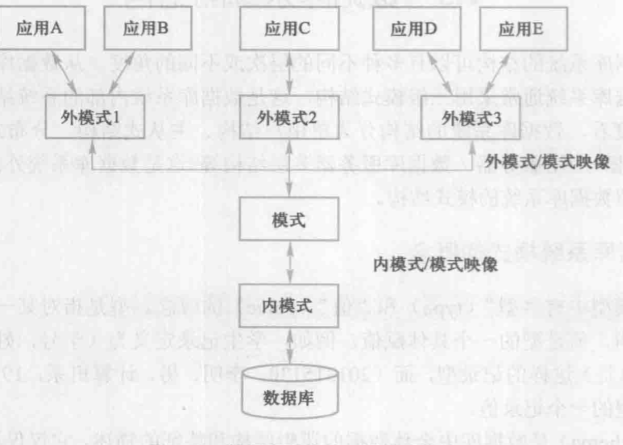

#### 第一次作业 3.19

4. **举出适合用文件系统而不是数据库系统的例子，以及适合用数据库系统的应用例子。**

   适合文件系统：数据的备份、程序使用过程中的临时文件、早期功能简单固定的应用系统。

   适合数据库系统：信息管理系统、学生管理系统、身份证系统、应用程序的用户信息管理系统。考虑安全性，完整性。

   关注存储的特点。

6. **数据库管理系统的主要功能有哪些？**
   * 数据定义
   
   * 数据组织、存储和管理
   
   * 数据操纵功能
   
* 数据库事务管理和运行管理
  
   * 数据库的建立和维护
   
   * 其他功能
   
     要点：究竟是什么身份。DBMS负责整个数据库从无到有过程中所有数据的操作及维护，以及权限管理，并发，完整，备份与回复、权限管理。
   
13. **试述关系模型的概念，定义并解释以下术语：**

    关系模型由关系数据结构、关系操作集合和关系完整性约束三部分组成。在用户观点下，关系模型中数据的逻辑结构是一张二维表，它由行和列组成。

    两点：本身的概念，逻辑数据模型，三要素以及用户角度。

    **关系，属性，域，元组，码，分量，关系模式**

    * 关系(Relation)：一张（二维）表格 
    * 元组(Tuple)：表中一行 
    * 属性(Attribute)：表中一列 
    * 码(Key)：唯一确定一个元组的某个属性组 
    * 域(Domain)：属性的取值范围 
    * 分量：元组中的一个属性值 
    * 关系模式：对关系的描述–即关系中的表头

15. **试述数据库系统的三级模式结构，并说明这种结构的优点是什么。**

    数据库系统三级结构由外模式、模式和内模式三级构成。

    

    * 模式(逻辑模式)
      * 全体数据的逻辑结构和特征的描述，是所有用户的公共数据试图。
      * 不涉及物理存储细节和硬件环境，与具体应用程序和开发工具无关。
      * 模式是数据库数据在逻辑级上的试图，一个数据库只有一个模式，综合考虑了所有用户的需求并将其结合成一个逻辑整体。
    * 外模式(子模式/用户模式)
      * 是数据库用户能够看到和使用的局部数据的逻辑结构和特征描述，是数据库用户的数据试图，是与某一应用有关的逻辑表示。
    * 内模式(存储模式)
      * 一个数据库只有一个内模式。是数据物理结构和存储方式的描述，是数据在数据库内部的组织方式。

    数据库三级系统模式可以是用户在逻辑层面处理数据，而不必关心数据在计算机中的表示和存储。

    **优点**：

    * 保证了数据的相对独立性 
    * 简化用户接口（只考虑相关的外模式）
    * 有利于数据共享 
    * 有利于安全保密 
    * 提高应用系统开发效

17. **什么叫数据与程序的物理独立性？什么叫数据与程序的逻辑独立性？为什么数据库系统具有数据与程序的逻辑独立性？**

    **物理独立性**：

    模式/内模式映像是唯一的，定义了数据全局逻辑结构与存储结构之间的对应关系。当数据库存储结构改变时，可通过该映像的相应改变来确保模式不需改变，从而应用程序也就不需改变了。

    **逻辑独立性 **：

    对于每个外模式，由映像定义其与外模式之间的对应关系。当模式改变时，对各个外模式/模式的映像做相应改变即可，不需修改外模式，由于程序针对外模式来进行编写的，也就不需修改应用程序。 

    数据库管理系统在三级模式之间提供的两层映像保证了数据库系统中的数据能够具有较高的逻辑独立性和物理独立性。

w