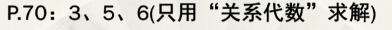
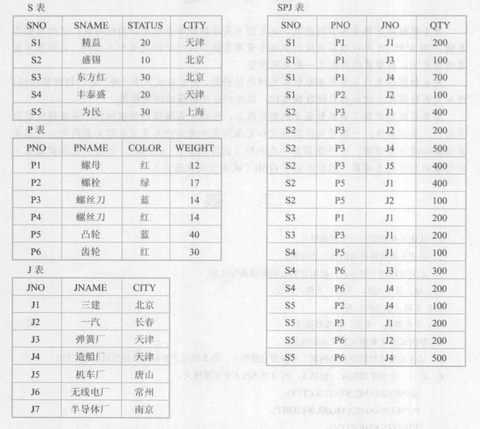

3. 定义并理解下列术语，说明他们的区别与联系

   1. 域，笛卡尔积，关系，元组，属性

      * 域：域是一组具有相同数据类型的值的集合。如自然数，整数，复数，字符串等。

      * 笛卡尔积：给定一组域$D_1,D_2,\cdots,D_n$，允许其中某些域是相同的，那么$D_1,D_2,\cdots,D_n$的笛卡尔积为

        $D_1\times{D_2}\times\cdots\times{D_n}=\{(d_1,d_2,\cdots,d_n)|d_i\in{D_i},i=1,2,\cdots,n\}$

        即各个域的所有值进行全排列生成的一系列数据。

      * 元组：元素$(d_1,d_2,\cdots,d_n)$叫做一个n元组，或者简称元组。或者也可以理解为关系或笛卡尔积中的一个元素，也就是他们中的一行。
   
      * 关系：$D_1\times{D_2}\times\cdots\times{D_n}$的子集叫做在域$D_1,D_2,\cdots,D_n$上的关系，表示为$R(D_1,D_2,\cdots,D_n)$,即笛卡尔积的子集。

      * 属性：关系也是一个二维表，表的每行对应于一个元组，表的每列对应于一个域。由于域可以相同，为了加以区分，必须为每列起一个名字，称为属性。

        联系与区别：

        先分别介绍，之后再区分。
   
     按照答题顺序描述出他们的关系。
   
     
   
   2. 主码，候选码，外部码
   
      * 候选码：关系中的某一属性组的值能唯一地标识一个元组，而其子集不能。
   
      * 主码：若一个关系有多个候选码，则选定其中一个为主码。
      * 外部码：设F是基本关系R的一个或一组属性，但不是关系R的码，如果F与基本关系S的主码Ks相对应，则称F是基本关系R的外部码，简称外码。基本关系R称为参照关系，基本关系S称为被参照关系或目标关系。关系R和S考研时相同的关系。
   
   3. 关系模式，关系，关系数据库
   
      * 关系模式：关系的描述称为关系模式,可以形式化地将其表示为 R(U,D,dom,F) 
      * 关系：关系是关系模式在某一时刻的状态或内容。关系模式是静态的、稳定的，而关系是动态的、随时间不断变化的，因为关系操作在不断的更行数据库中的数据。
      * 关系数据库：关系数据库也有型和值之分。关系数据库的型也称为关系数据库模式，是对关系数据库的描述，它包括若干域的定义及在这些域上所定义的若干关系模式。关系数据库的值是这些关系模式在某一时刻所对应的关系的集合，通常被称为关系数据库。

5. 试着描述关系模型的完整性规则。在参照完整性中，说明什么情况下外码属性的值可以为空值？
   * 关系模型必须满足的完整性条件
     * 实体完整性
     * 若A是关系R(U)(A∈U)上的主属性，则属性A不能取空值。 即主属性不能为空。
   * 参照完整性
     * 属性（属性组）X是关系R的外部码，Ks是关系 S的主码，且X与Ks相对应（即X, Ks是定义在同一个域上），则R中任一元组在X上的值为：X= 空值或S中的某个元组的Ks值。 即要参照的东西要么时主属性，要么就没有。
     * 即属性F本身不是主属性时可以取空值，否则不能取空值。

6. 
   1. 求供应工程J1零件的供应商号码SNO；

      $$\prod_{SNO}(\sigma_{JNO='J1'}(SPJ))$$

   2. 求供应工程J1零件P1的供应商号码SNO

      $$\prod_{SNO}(\sigma_{JNO='J1' \bigwedge PNO='P1'}(SPJ))$$

   3. 求供应工程J1零件为红色的供应商号码SNO

      $$\prod_{SNO}(\sigma_{JNO='J1'}(SPJ)\bowtie\prod_{PNO}(\sigma_{COLOR='红'}(P))$$

   4. 求没有使用天津供应商生产的红色零件的工程号JNO；

      $$\prod_{JNO}(\sigma_{COLOR<>'红'\bigvee CITY<>'天津'}(SPJ\bowtie{P}\bowtie{S}))$$

   5. 求至少用了供应商S1所提供给定全部零件的工程号JNO；

      $$\prod_{JNO,PNO}(\sigma_{SNO='S1'}(SPJ))\div\prod_{PNO}(P)$$

7. 练习题

   1. 查询计算机系的全体学生

      $\sigma_{Sdept='CS'}(S)$

   2. 查询有那些系

      $\prod_{Sdept}(S)$

   3. 查询至少选修1号课程和3号课程的学生学号

      $\prod_{Sno,Cno}(SC)\div\prod_{Cno}(\sigma_{Cno='1'\bigvee Cno='3'}(Cno))$

   4. 查询选修了2号课程的学生学号

      $\prod_{Sno}(\sigma_{Cno='2'}(SC))$

   5. 查询至少选修了一门其先修课程为5号课程的学生姓名

      $\prod_{Sname}(\sigma_{Cpmo='5'} \bowtie SC \bowtie \prod_{Sno,Sname}(S) )$

   6. 查询选秀了全部课程的学生学号和姓名

      $(\prod_{Sno,Cno}(SC)\div \prod_{Cno}(C) )\bowtie\prod_{Sno,Sname}(S)$

