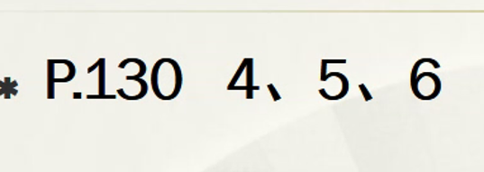

1. 试叙述SQL的特点

   * 高度非过程化语言：用户只需提出“干什么”，至于“怎么干”由DBMS解决；用户只需要在查询语句中提出需要什么，DBMS即可完成存取操作，并把结果返回给用户。
   * 面向集合的语言：每一个SQL的操作对象是一个或多个关系，操作的结果也是一个关系。
   * 一种语法结构，两种使用方式：即可独立使用，又可嵌入到宿主语言中使用，具有**自主型和宿主型**两种特点。
   * 具有查询、定义、操纵和控制四种语言一体化的特点。它只向用户提供一种语言，但该语言具有上述多种功能，可独立完成数据库生命周期中的全部活动。
   * 语言简洁，易学易用

2. 说明DROP TABLE时，RESTRIDT和CASCADE的区别

   * CASCADE:：连同引用该表的试图、完整性约束一起自动撤销
   * RESTRICT：没有表引用该表时，才可以撤销

3. 有两个关系S(A,B,C,D)和T(C,D,E,F)，写出下列查询等价的SQL表达式

   1. $\sigma_{A=10}(S)$

      ```sql
      select *
      from S
      where A = '10';
      ```

   2. $\prod_{A,B}(S)$

      ```sql
      select A, B
      from S;
      ```

   3. $S\bowtie{T}$

      ```sql
      select A, B, S.C, S.D, T.C, T.D, E, F
      from S, T
      where S.C = T.C and S.D = T.D
      ```

   4. $S\bowtie_{S.C=T.C}{T}$

      ```sql
      select *
      from S, T
      where S.C = T.C;
      ```

   5. $S\bowtie_{A<E}{T}$

      ```sql
      select *
      from S, T
      where S.A < T.E
      ```

   6. $\prod_{C,D}(S)\times{T}$

      ```sql
      select S.C,S.D,T。*
      from S, T
      ```

4. 用SQL语句建立第2章习题6中的4个表；针对建立的4个表用SQL语言完成第章习题中的查询。

   建立S表：

   ```sql
   CREATE TABLE S( 
       			SNO CHAR(3),        
      				SNAME CHAR( 10),     
       			STATUS CHAR(2),         
       			CITY CHAR( 10)
                 );
   ```

   建立P表：

   ```sql
   CREATE TABLE P( 
       			PNO CHAR(3),
   				PNAME CHAR( 10),
   			   	COLOR CHAR(4),
   			   	WEIGHT INT
                 )；
   ```

   建立J表

   ```sql
   CREATE TABLE J(
       			JNO CHAR(3),
   				JNAME CHAR( 10),
   				CITY CHAR(10)
   );
   ```

   建立SPJ表：

   ```sql
   CREATE TABLE SPJ(
       			SNO CHAR(3),
   				PNO CHAR(3),
   				JNO CHAR(3),
   				QTY INT
   );
   ```

   查询：

   1. 求供应工程J1零件的供应商号码SNO。

      ```sql
      SELECT SNO
      FROM SPJ
      WHERE JNO='JI';
      ```

   2. 求供应工程JI零件Pl的供应商号码SNO。

      ```sql
      SELECT SNO
      FROM SPJ
      WHERE JNO= 'JI' AND PNO= 'P1';
      ```

   3. 求供应工程JI零件为红色的供应商号码SNO。

      ```sql
      SELECT SNO
      FROM SPJ
      WHERE JNO='J1'
      	AND PNO IN(	
            		SELECT PNO
      			FROM P
      			WHERE COLOR='红'
          );
      ```

   4. 没有使用天津供应商生产的红色零件的工程号JNO。

      ```sql
      SELECT JNO
      FROM J
      WHERE NOT EXISTS
      	(
               SELECT *
      		FROM SPJ,S,P
      		WHERE SPJ.JNO = J.JNO AND SPJ.SNO = S.SNO
      		AND SPJ.PNO = P.PNO AND S.CITY='天津'
      		AND P.COLOR = '红'
          );
      ```

   5. 至少用了供应商SI所供应的全部零件的工程号JNO。

      ```sql
      SELECT DISTINCT JNO
      FROM SPJ SPJZ
      WHERE NOT EXISTS 
      	(
              SELECT*
      		FROM SPJ SPJX
      		WHERE SNO='S1'
      		AND NOT EXISTS (
                   SELECT *
      			FROM SPJ SPJY
      			WHERE SPJY.PNO = SPJX.PNO
      			AND SPJY.JNO = SPJZ.JNO)
          );
      ```

5. 针对习题3中的4个表，试用SQL语言完成以下各项操作：

   1. 出所有供应商的姓名和所在城市。

      ```sql
      SELECT SNA ME, CITY FROM S;
      ```

   2. 找出所有零件的名称、颜色、重量。

      ```sql
      SELECT PNAME,COLOR,WEIGHT FROM P;
      ```

   3. 找出使用供应商S1所供应零件的工程号码。

      ```sql
      SELECT JNO
      FROM SPJ
      WHERE SNO='S1';
      ```

   4. 找出工程项目J2使用的各种零件的名称及其数量。

      ```sql
      SELECT P.PNAME,SPJ.QTY
      FROM P.SPJ
      WHERE P.PNO = SPJ.PNO AND SPJ.JNO='J2';
      ```

   5. 找出上海厂商供应的所有零件号码。

      ```sql
      SELECT DISTINCT PNO
      FROM SPJ
      WHERE SNO IN
      	(
              SELECT SNO
      	    FROM S
      	 	WHERE CITY = '上海'
          );
      ```

   6. 找出使用上海产的零件的工程名称。

      ```sql
      SELECT JNAME
      FROM J,SPJ,S
      WHERE J.JNO = SPJ.JNO
      	AND SPJ.SNO = S.SNO
      	AND S.C1TY='上海';
      ```

   7. 找出没有使用天津产的零件的工程号码。

      ```sql
      SELECT JNO
      FROM J
      WHERE NOT EXISTS
      	(
               SELECT *
      		FROM SPJ,S
      		WHERE SPJ.JNO = J.JNO
      			AND SPJ.SNO = S.SNO
      			AND S.CITY='天津'
          );
      ```

   8. 把全部红色零件的颜色改成蓝色。

      ```sql
      UPDATE P
      SET COLOR = '蓝'
      WHERE COLOR ='红';
      ```

   9. 由S5供给J4的零件P6改为由S3供应，请作必要的修改。

      ```sql
      UPDATE SPJ
      SET SNO='S3'
      	WHERE SNO='S5'
      	AND JNO='J4'
      	AND PNO='P6';
      ```

   10. 从供应商关系中删除S2的记录，并从供应情况关系中删除相应的记录。

       ```sql
       DELETE
       FROM SPJ
       WHERE SNO='S2';
       
       DELETE
       FROM S
       WHERE SNO= 'S2';
       ```

   11. 请将(S2,J6,P4,200)插入供应情况关系。

       ```sql
       INSERT INTO SPJ(SNO,JNO,PNO,QTY) INTO 
       VALUES(S2,J6,P4,200) ; 
       ```

6. 什么是基本表？什么是视图？两者的区别和联系是什么？

   * 基本表是本身独立存在的表，在SQL中一个关系就对应一个基本表。
   * 视图是从一个或几个基本表导出的表。
     * 视图本身不独立存储在数据库中，是一个虚表。即数据库中只存放视图的定义而不存放视图对应的数据,这些数据仍存放在导出视图的基本表中。
     * 视图在概念上与基本表等同，用户可以如同基本表那样使用视图,可以在视图上再定义视图。